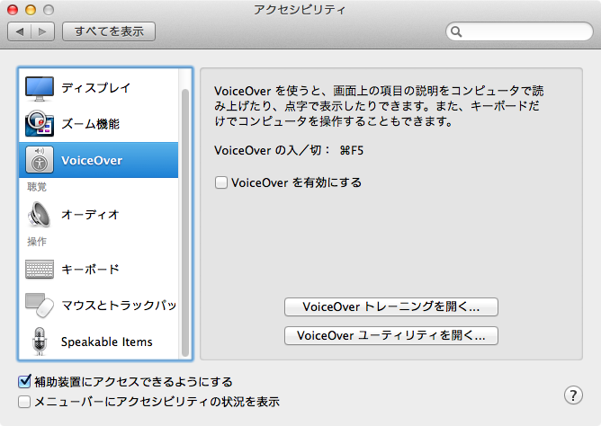

MacOSXのAutomatorで席替えプログラムを作ってみました。  
名簿は組み込んでいないため、意外と汎用的です。

## 概要

以下の処理を行います

1. 文字入力を受け付ける
2. Perlでランダム処理する
3. 結果を合成音声（Text-To-Speech）で読み上げる

## 対応OS

MountainLionで動作を確認していますが、以下のOSで動くはずです。

* MacOS X 10.5 Leopard
* MacOS X 10.6 SnowLeopard
* MacOS X 10.7 Lion
* MacOS X 10.8 MountainLion

## 利用方法

ダブルクリックすると、文字入力ウィンドウが現れます。  
カンマ区切りで入力し、OKボタンを押してください。  
シャッフル後、結果発表を行います。

## 環境構築方法

もしまだ`Kyoko Compact`しかマシンに入っていない場合は、  
合成音声ファイルをインストールしてください。

1. `システム環境設定`→`アクセスシビティ`→`VoiceOver`→`VoiceOver ユーティリティを開く…`を押します。

2. `スピーチ`に切り替えて、声のプルダウンの`カスタマイズ…`を選択し、`Kyoko`にチェックボックスを入れて確定します。

3. 確認画面のあと、しばらくするとダウンロードが終わり、使えるようになります。

## 編集方法

Automator.app を起ち上げて、それで開いてください。

## 制作者

[@yoshi_ken](https://twitter.com/yoshi_ken)
